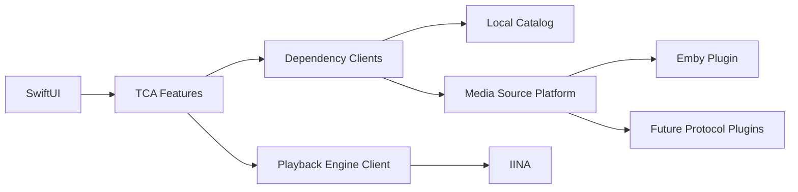

# CineLark Architecture

- **Status:** Accepted direction; implementation details remain Draft
- **Last updated:** 2026-08-26

## 1. System context

```text
                       ┌────────────────────┐
                       │ CineLark Remote    │
                       │ Flutter mobile app │
                       └─────────┬──────────┘
                                 │ pinned WSS on LAN
                                 ▼
                       ┌───────────────────────────────┐
                       │ Rust Remote Gateway Transport │
                       └─────────┬─────────────────────┘
                                 │ private child stdio
                                 ▼
┌────────────────┐      ┌───────────────────────────────┐
│ Media Sources  │◀────▶│ CineLark for Mac             │
│ Emby / future  │      │ SwiftUI + TCA application     │
└────────────────┘      │ Catalog + Profile projection  │
                        │ PlaybackFeature + IINA client │
                        └───────────────┬───────────────┘
                                        │ private child stdio
                                        ▼
                        ┌───────────────────────────────┐
                        │ bundled Rust Bridge Helper    │
                        └───────────────┬───────────────┘
                                        │ loopback-only HTTP
                                        ▼
                        ┌───────────────────────────────┐
                        │ thin IINA JavaScript Plugin   │
                        └───────────────┬───────────────┘
                                        ▼
                                   IINA / mpv
```

## 2. Ownership rules

| Concern | Owner |
| --- | --- |
| Account credentials and provider token | Source plugin runtime; secrets persist only through Keychain client |
| Keychain lifecycle | Mac app; plugin stores only its bridge secret |
| UI-facing library metadata | Local Catalog; source plugins refresh and normalize it |
| Favorites and resume state | Local profile repository; optional explicit remote import/mirror |
| Semantic navigation and persisted sidebar preference | TCA application state |
| Hover, pointer, transient focus, and live geometry | SwiftUI local state |
| Version selection | Source playback resolver, orchestrated by `PlaybackFeature` |
| Playback URL construction | Provider adapter |
| Decode, HDR, tracks, subtitles | IINA/mpv |
| Player transport and telemetry | Rust Bridge Helper + IINA plugin |
| Provider progress writes | Mac app |
| Remote TLS, framing, proof verification, sequencing, and rate limits | Rust Remote Gateway |
| Remote pairing approval, device records, capabilities, and semantic authorization | Mac app |

The plugin never calls provider APIs. The Remote never receives provider
credentials or directly controls the plugin.

## 3. Logical modules

The Mac implementation is Apple-native: Swift 6 with strict concurrency,
SwiftUI for product UI, and focused AppKit adapters where macOS windowing,
input, or focus behavior requires them. Apple modules live as targets in one
local Swift package initially. The Remote is a separate Flutter/Dart runtime;
shared behavior crosses that boundary through versioned schemas and conformance
fixtures, not linked Swift code.

### 3.1 `CineLarkDomain`

Provider-neutral value types and use cases:

- media identifiers, summaries, details, seasons, episodes, and people
- image references and playback state
- media assets, audio/subtitle tracks, and playback descriptors
- pagination, sorting, favorites, and provider errors

It contains no networking, UI framework, provider DTO, or IINA API types.

### 3.2 `CineLarkPluginAPI` and `CineLarkCatalog`

`CineLarkPluginAPI` defines capability-based source factories and account-bound
runtimes. `CineLarkCatalog` normalizes provider values into a local Core Data
catalog with exact source isolation and one-to-many locator support. TCA sees
both only through `MediaPlatformClient`; provider adapters translate unstable
external contracts into stable value models.

### 3.3 `CineLarkEmby`

Owns:

- UDP discovery and public server verification
- standard Emby authentication and Keychain token bridging
- Emby request/response models and offset-cursor translation
- hierarchy, artwork, playback, import, mirror, and check-in capability clients
- legacy UHDNow plugin-ID migration proposals without private endpoint calls

Raw DTOs stay internal to this package.

### 3.4 Cache infrastructure

`CoreDataCatalogStore` is the current cached-first metadata source. It owns
normalized recreatable records and reports logical payload usage independently
of SQLite structural overhead. Artwork uses a separate bounded Kingfisher
memory/disk pipeline. `LegacyProviderArtifacts` removes the former metadata
cache directory at startup through a narrow, path-validated migration cleanup;
the retired cache is not a runtime store or a user-visible cache category.

`CacheClient` aggregates Catalog and artwork infrastructure for `CacheFeature`.
Before a destructive purge, the feature delegates to `AppFeature` so active
Library/Search writers are cancelled and dependent detail routes are removed.
Profile/CloudKit stores, source configuration, Keychain values, and Remote
pairing records are outside this boundary.

See [`interfaces/metadata-cache.md`](interfaces/metadata-cache.md).

### 3.5 `CineLarkApplication`

TCA 1.26.1 is the sole application-layer state and orchestration convention.
`AppFeature` scopes Navigation, Profile, Source, Library, Search, Playback,
Remote, and Cache; media/person destinations live in `StackState`. Views read
scoped stores and send actions. Dependency clients isolate repositories,
plugins, playback, and gateway lifetimes from reducer state.

The main sidebar is a content information architecture: Home, Movies, Series,
Favorites, and Search. Configuration does not add sidebar destinations or one
toolbar button per subsystem. The system Settings scene composes General,
Profiles & Sources, Remote, and Storage categories from the same root Store.
Transient Settings-window presentation is owned by SwiftUI; only profile/source
selection intent and its playback-stop confirmation enter `AppFeature` state.

### 3.6 `PlaybackFeature`

Maintains one observable logical playback session while `PlaybackEngineClient`
adapts the independent IINA launcher:

1. Resolve provider item and selected media asset.
2. Decide resume/start-over position.
3. Request an ephemeral playback descriptor.
4. Connect and authenticate the IINA Bridge.
5. Send provider-neutral `play` command.
6. Translate bridge telemetry into local state.
7. Coalesce and write provider progress.
8. Send a final stopped update and close the logical session.

A new `play` supersedes the previous logical session and finalizes it first.

### 3.7 `CineLarkGateway`

A self-contained native helper bundled and signed inside CineLark.app. The Mac
supervises one child process and exchanges center-namespaced framed JSON over
stdio. The process shell and Tokio runtime are shared; `IINABridgeCenter` and
`RemoteGatewayCenter` retain separate state, protocols, credentials, ports, and
network boundaries. The helper contains no provider logic or persistent daemon
behavior.

### 3.8 `IINABridgePlugin`

A minimal JavaScript/TypeScript package with no provider dependency. It polls
the Rust helper for commands, posts sanitized events, and maps the bridge
protocol to IINA public plugin APIs and mpv properties/events.

### 3.9 `RemoteGatewayCenter`

The Remote center inside the bundled Rust child owns the LAN TLS/WebSocket
endpoint, certificate fingerprinting, frame limits, pairing-secret expiry,
device proof verification, per-connection sequencing, and rate limits. It
forwards only authenticated envelopes to the Mac over private length-prefixed
JSON stdio. It has no provider, navigation, or playback authority and remains
isolated at the code, state, protocol, credential, port, and listener layers
from the loopback-only IINA bridge center.

See [ADR-0009](decisions/0009-unified-native-gateway.md).

### 3.10 `RemoteGatewayCoordinator` and `RemoteFeature`

A Mac application service owns TLS identity/device-record persistence, pairing
presentation and approval, Bonjour advertisement, capability calculation,
snapshot publication, and semantic-command authorization. `RemoteFeature`
subscribes through a dependency client and owns the rendered projection.
Semantic navigation and playback commands enter the same TCA action paths as
local input. Neither layer exposes provider DTOs, credentials, playback URLs,
or SwiftUI view identities.

### 3.11 `CineLarkRemote`

A focused Flutter application for iOS and Android. It provides contextual
pairing, login, navigation, search text-entry, and now-playing control surfaces.
It does not contact providers or play media locally. QR scanning, certificate
pinning, secure storage, camera/local-network permissions, and lifecycle
reconnect stay behind Flutter infrastructure adapters or narrow platform
channels.

## 4. Data flow

### 4.1 Browse

```text
View → TCA Action → Library/Search Feature → Local Catalog
                                      │
                                      └→ Source Runtime → Provider API
View ← Scoped Store ← IDs + snapshots ← normalized Catalog page
```

Expired metadata falls back to stale data only for transient provider failures.
Views never depend on provider DTOs.

### 4.2 Play and resume

```text
Selection
  → PlaybackFeature.play(locator)
  → source runtime resolves an ephemeral descriptor
  → PlaybackEngineClient.open(descriptor, startPosition)
  → Rust helper queues authenticated command
  → IINA plugin calls core.open(url)
  → file-loaded
  → seekTo(startPosition)
  → state/position events
  → provider.reportProgress(...)
```

Resume is applied after a matching `file-loaded` event, not merely after sending
`open`, to avoid races with mpv initialization.

For series episodes, CineLark discovers the ordered remainder of the series in
the background but keeps no future URL in IINA's playlist. At natural EOF it
reports the completed item, resolves the next episode's asset and capability
URL, sends `player.stop` for the completed session, and then sends the new
`player.play` command. This matches a second manual in-app play action. The
global plugin posts both commands to the same managed player ID while the player
plugin calls `core.open` to replace its single content item. The incoming
session does not become terminal-eligible before its own `file-loaded`, and a
replacement timeout never creates another player window. The managed player
sets mpv `keep-open=yes` so IINA cannot close the window before replacement.
Natural EOF is observed from mpv's
`eof-reached` property because IINA's generic JavaScript event callbacks do not
expose `end-file` details. A
telemetry gap may request a fresh state snapshot but does not
clear the continuation metadata. Capability URLs are generated only when their
episode is about to open.

### 4.3 Progress

Bridge telemetry uses seconds. Provider adapters convert to their wire units at
the boundary; standard Emby check-ins use ticks where required.

The playback feature uploads one immutable snapshot when an item becomes active and
periodically coalesces later position changes. Timers are playback-ID scoped,
and the serial synchronization worker retains only the latest pending progress
snapshot for a slow provider. A terminal stopped snapshot forms an ordering
barrier before a replacement item's first progress write. Successful terminal
writes drive cache invalidation, observable playback revision, and serialized
App refresh; failed writes do not advance local synchronization state. Exact
retry policy is Open.

## 5. State and concurrency

- SwiftUI observes scoped TCA stores. Domain values remain immutable and
  UI-independent; transient hover, focus, animation, and geometry stay in local
  SwiftUI state.
- Feature state retains semantic state, query identity, stable IDs, and bounded
  presentation snapshots. Managed objects, complete catalogs, plugin runtimes,
  gateway transports, and playback engines stay behind dependencies.
- Provider sessions, bridge sessions, image/cache coordination, and progress
  writes use Swift actors and structured concurrency.
- Provider and bridge operations support cancellation.
- Each playback request and session has a unique opaque ID; late results/events
  from superseded sessions are ignored.
- Progress writes are immutable, playback-ID scoped, serialized across item
  replacement, and monotonic within an item unless the user explicitly seeks
  backward. Pending non-terminal writes for one playback may be coalesced.
- Provider token refresh/login changes invalidate derived playback URLs.

## 6. Failure boundaries

| Failure | Required behavior |
| --- | --- |
| Provider unavailable | Preserve navigation state; show retry affordance |
| Session expired | Reauthenticate without exposing credentials to plugin |
| Asset/domain resolution failed | Do not launch IINA; offer retry/version change |
| IINA absent | Explain installation requirement; library remains usable |
| Plugin absent/incompatible | Show detected protocol versions and remediation |
| Bridge disconnected | Keep provider state; reconnect or terminate session cleanly |
| Progress write failed | Coalesce retry; never pause playback |
| Tokenized URL expired | Resolve a new descriptor instead of replaying cached URL |

## 7. Security boundaries

- External provider traffic uses HTTPS.
- The Mac app is the only component allowed to hold provider credentials.
- Playback descriptors are ephemeral and must not be persisted.
- Bridge traffic is local but still untrusted until authenticated.
- The preferred Rust helper binds explicitly to loopback and authenticates the
  plugin; the Mac side uses private child-process stdio.
- The audited IINA WebSocket server is not loopback-restricted and has no TLS,
  so it is not the default transport. Any fallback requires a separate security
  review.
- Remote traffic terminates in the isolated Rust gateway and uses TLS, explicit
  pairing, certificate pinning, connection-bound device proofs, device-scoped
  credentials, exact sequencing, rate limits, and revocation. The Mac remains
  the only semantic authorization authority.
- Every diagnostic layer applies structured redaction before formatting values.

## 8. Repository boundaries

```text
apps/macos/                         SwiftUI macOS app and Xcode project
apps/remote/                        Flutter app for iOS and Android
packages/apple/CineLarkKit/         local Swift package with focused targets
packages/rust/cinelark-gateway/     one helper with independent IINA and Remote centers
plugins/iina/                       minimal JavaScript/TypeScript adapter
specs/common/                       cross-language domain/wire primitives
specs/bridge/                       Mac app ↔ IINA contracts
specs/remote/                       Flutter Remote ↔ Mac app contracts
specs/uhdnow/                       observed external API description
shared/design/                      platform-neutral design tokens
shared/brand/                       source vector brand assets
fixtures/conformance/               sanitized cross-runtime protocol vectors
```

Generated Swift/Rust/Dart/TypeScript files are outputs, never the source of truth.
The exact code generator remains an implementation spike; schema compatibility
and conformance vectors are required even if a runtime initially uses handwritten
adapters.

## 9. Testing strategy

- Domain: pure unit tests for mapping-independent behavior and resume rules.
- Provider: contract tests against synthetic redacted fixtures.
- Bridge: shared schema vectors in Swift, Rust, and JavaScript; helper process,
  loopback binding, long-poll latency, crash, and reconnect integration tests.
- Remote: shared schema/cryptographic vectors executed by Rust, Swift, and Dart;
  pinned-WSS pairing/authenticated-forwarding coverage; plus one-time secret,
  sequencing, rate-limit, stable-error, playback-navigation, and text-revision
  regressions. Physical-device reconnect and revocation remain release smokes.
- Playback: integration tests with a local fake bridge before IINA automation.
- macOS UI: deterministic focus-navigation tests for rows, grids, detail pages,
  and state restoration.
- Flutter UI: widget/golden tests for controls and connection states, with
  platform integration tests for discovery and secure storage.
- Security: secret scanning and URL/header redaction tests in CI.
## 10. Application and media-source boundaries

SwiftUI views read scoped TCA stores. TCA reducers own semantic feature state,
navigation, and effect orchestration. They access the media platform through
dependency clients; plugin runtimes, the local catalog, persistence, IINA, and
native gateways remain actor/service layers using Swift concurrency.


