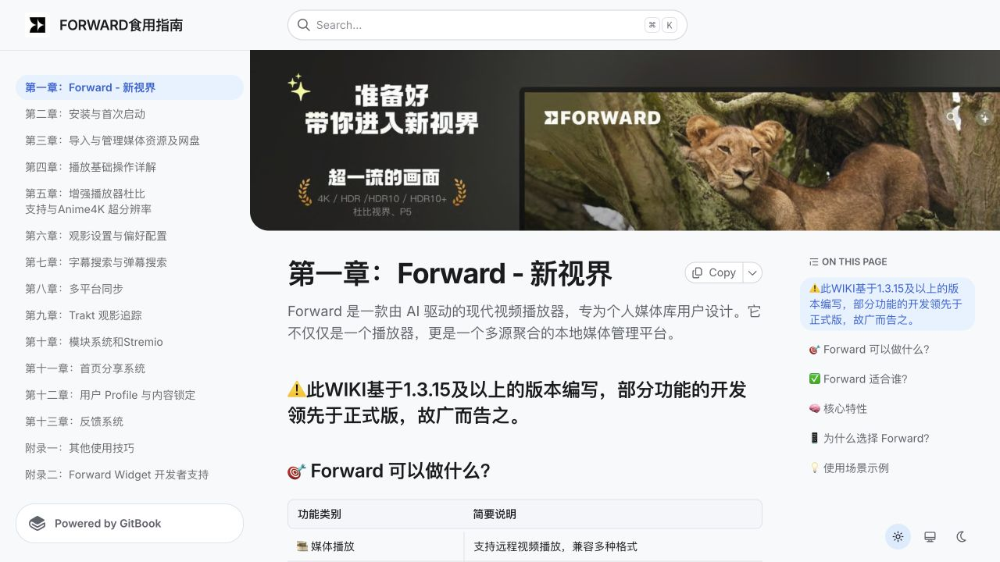
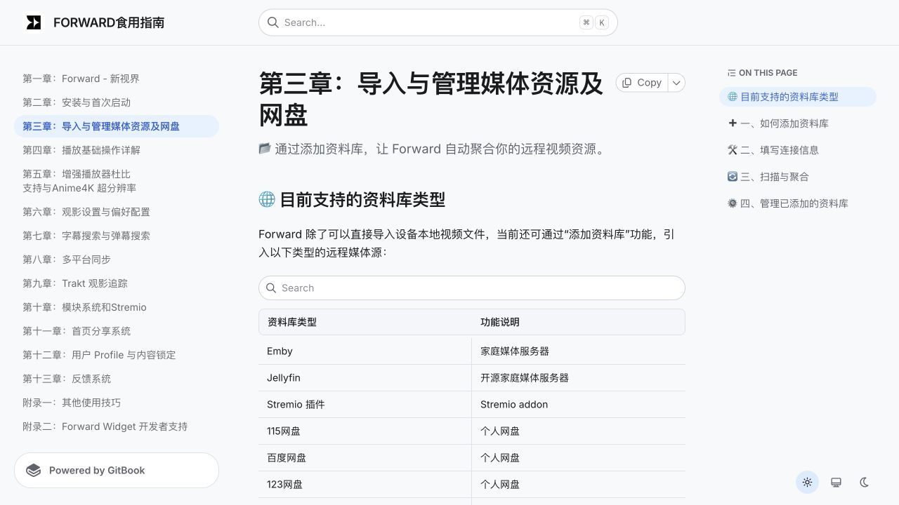
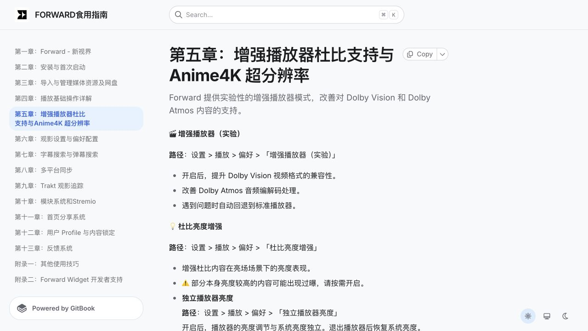
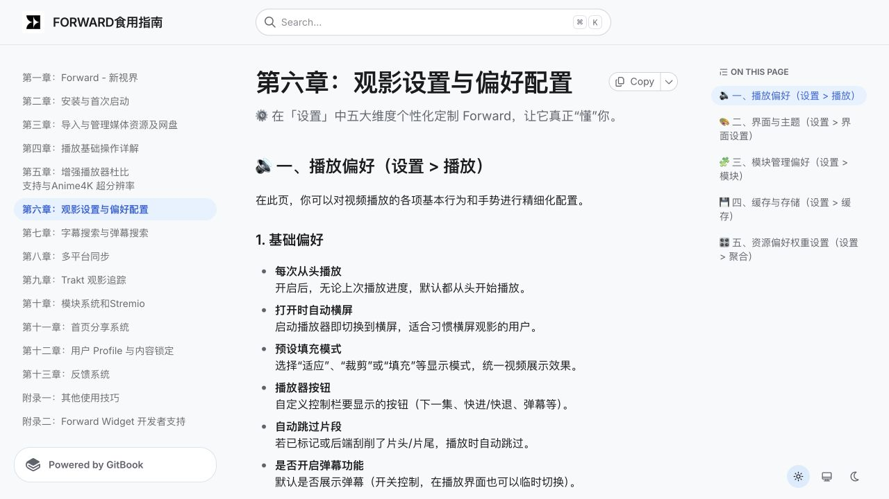
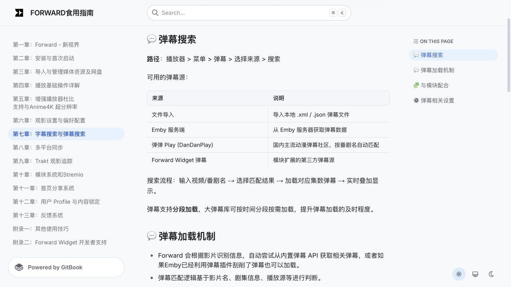
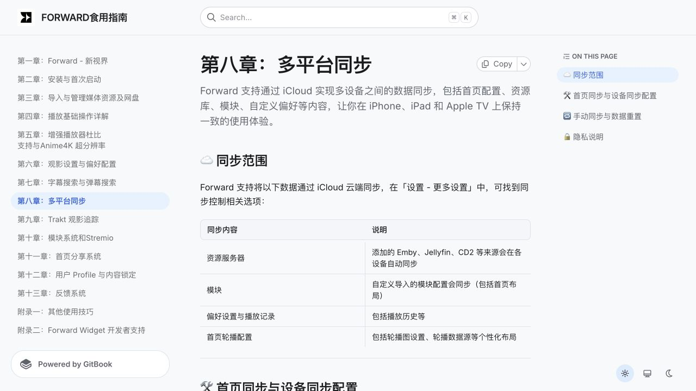
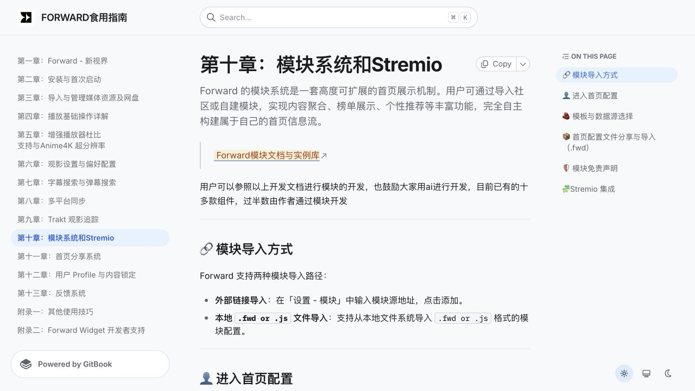
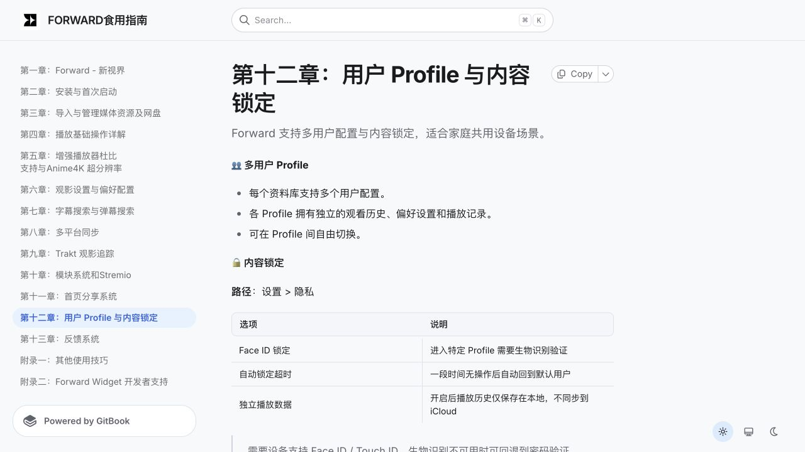
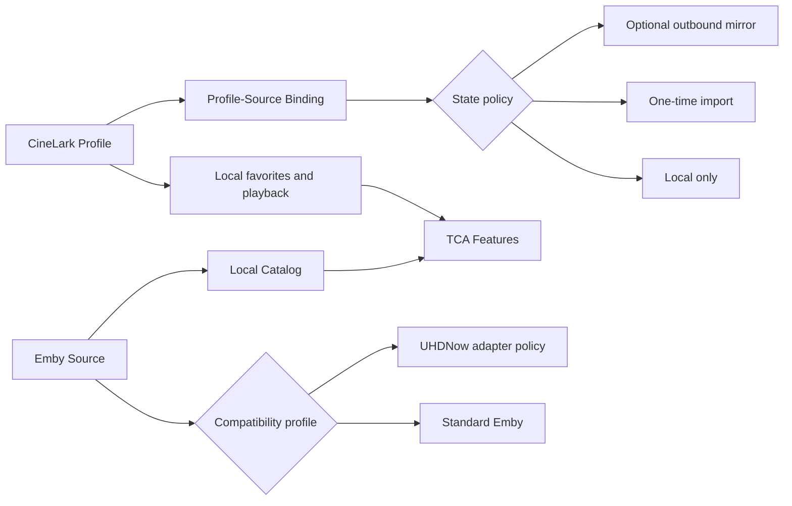

# Forward Competitive Audit

| | |
| --- | --- |
| **Status** | Observed product research; not a CineLark contract |
| **Captured** | 2026-08-27 |
| **Subject** | Forward 1.3.15+ documentation |
| **CineLark scope** | Media sources, profiles, playback, cache, sync, and extension boundaries |

## Direct conclusion

Forward is useful as evidence that a personal media client can grow from a
player into a local-first, multi-source media platform. CineLark should adopt
that product direction without copying Forward's runtime module model or its
configuration density.

The most important resulting decisions are:

1. UHDNow is not a user-visible media-source plugin. It is an Emby
   compatibility profile selected after server verification.
2. A CineLark Profile is the viewing identity and the owner of local favorites,
   progress, and preferences. An Emby user remains a remote authentication and
   authorization principal.
3. Local state is the UI truth. Remote state import and outbound mirroring are
   explicit policies rather than implicit consequences of connecting Emby.
4. Cache remains a product capability after `CachedMediaLibraryProvider` is
   removed. Storage accounting, purge, and prefetch belong to a dedicated cache
   service and Settings surface.
5. Source, subtitle, metadata, sync, and playback-engine integrations remain
   separate compile-time plugin roles. CineLark does not load third-party code
   at runtime.

Forward's documentation explicitly warns that some documented capabilities may
lead the production release. Every capability below is therefore marked as
observed documentation evidence, not as a guarantee of shipped behavior.

## Adoption matrix

| Area | Forward evidence | CineLark decision | Priority |
| --- | --- | --- | --- |
| Product position | Local-first, multi-source media management rather than playback alone | Keep the browsing shell content-focused while Catalog normalizes source data | Foundation |
| Media sources | Emby, Jellyfin, Stremio, WebDAV/Alist, SMB, NAS, and cloud-drive sources | Standard Emby first; UHDNow as compatibility policy; Jellyfin and file protocols follow | P0/P1 |
| Playback | Source selection, segment skipping, enhanced playback, and quality controls | Implement deterministic playback selection, thumbnails, and segment metadata before native enhancement work | P0/P1 |
| Cache | Capacity controls, buffering, and source preferences in Settings | Dedicated cache accounting, one-click purge, and next-item prefetch | P0 |
| Subtitles and danmaku | Local, server, DanDanPlay, and module-provided sources | Independent subtitle-provider role with explicit matching and provenance | P1 |
| iCloud | Server definitions, modules, preferences, layouts, and playback state | Sync Profile state and secret-free Source Definitions; keep tokens and active selection device-local | P0 |
| Modules and Stremio | Runtime `.fwd`/`.js` modules and Stremio Addons | Keep role-based SwiftPM plugins; defer Stremio; reject runtime JavaScript | P2 |
| Profiles | Independent history, preferences, progress, local-only playback, and content locking | Global CineLark Profiles spanning sources; optional remote import/mirror per binding | P0 |

## Evidence review

### 1. Product positioning

**General health:** Strong direction; release-state caveat.

- **Observed:** Forward presents itself as a local media-management platform
  that aggregates multiple sources instead of only playing URLs.
- **Useful for CineLark:** This supports the Catalog-first direction and the
  decision to keep source configuration out of the primary content sidebar.
- **Risk:** "AI-driven" is positioning language. CineLark should not make AI a
  product dependency without a concrete user task and measurable benefit.
- **Verification limit:** The screenshot documents stated scope, not runtime
  performance or the completeness of source aggregation.

### 2. Source management

**General health:** Strong and strategically relevant.

- **Observed:** Forward documents Emby, Jellyfin, Stremio, multiple cloud
  drives, WebDAV/Alist, SMB, and NAS-related sources.
- **Useful for CineLark:** A single Source Center in Settings can expose
  available source types while the library UI consumes normalized Catalog
  queries.
- **Decision:** Present `Emby` as the source type. Detect UHDNow after public
  server-info validation and activate an internal `uhdnow` compatibility
  profile for endpoint, pagination, or metadata quirks.
- **Risk:** A large source catalog can produce inconsistent setup and browsing
  semantics. Capability descriptors must drive disclosure and unsupported
  actions.

### 3. Enhanced playback

**General health:** Experimental.

- **Observed:** Forward documents an experimental enhanced player, Dolby
  compatibility handling, contrast enhancement, and Anime4K upscaling.
- **Useful for CineLark:** Explicit fallback behavior is more valuable than a
  long feature list. Playback resolution should rank candidates and retain a
  reason for each rejection or fallback.
- **Decision:** Prioritize version selection, direct-play compatibility,
  segment metadata, thumbnails, and reliable IINA handoff.
- **Deferred:** Anime4K and other native enhancement paths duplicate work
  already owned by IINA/mpv and are not required for the media-source platform.

### 4. Settings, cache, and playback policy

**General health:** Capable but dense.

- **Observed:** Forward centralizes player behavior, interface preferences,
  module controls, storage/cache, and source preference weighting in Settings.
- **Useful for CineLark:** This validates converging configuration into the
  macOS Settings scene rather than growing toolbar and sidebar affordances.
- **Decision:** Storage shows catalog and artwork usage separately, offers a
  one-click safe purge, and keeps user favorites and progress outside the purge
  boundary. Playback source ranking is modeled as a policy, not scattered
  toggles.
- **Risk:** Exposing every provider capability produces a settings wall.
  CineLark should reveal controls only when the active engine or source supports
  them.

### 5. Subtitle and danmaku providers

**General health:** Strong capability coverage.

- **Observed:** Forward documents local files, Emby-provided data,
  DanDanPlay, module-provided sources, matching, and segmented loading.
- **Useful for CineLark:** Subtitle lookup is not intrinsically part of a media
  source. A provider can use `ContentKey`, episode identity, title/year, and the
  selected locator without taking ownership of browsing or playback.
- **Decision:** Add a `SubtitleProviderPlugin` role with provenance, confidence,
  language, format, and timing metadata.
- **Risk:** Matching quality, provider stability, privacy, and regional legal
  constraints require independent failure and permission handling.

### 6. iCloud and device sync

**General health:** Strong product model.

- **Observed:** Forward documents synchronization of source definitions,
  modules/layouts, preferences, and playback history, plus device-specific
  controls and local-only playback data.
- **Useful for CineLark:** Cloud state and device-local operational state are
  separate concerns. An active source, active profile, credentials, caches, and
  queues should not become shared UI state merely because profiles sync.
- **Decision:** CloudKit stores Profile, favorite, playback, snapshot, and
  import records. Local storage keeps source configuration, bindings, active
  selections, mirror queues, and Catalog. Keychain keeps credentials.
- **Risk:** Source definitions must be secret-free before synchronization.

### 7. Modules and Stremio

**General health:** Powerful, with a high trust and maintenance cost.

- **Observed:** Forward separates module templates from data sources, supports
  sharing/import, accepts local `.fwd` or `.js` modules, and integrates Stremio
  Addons for catalog, metadata, stream, and subtitle data.
- **Useful for CineLark:** The separation between presentation, catalog data,
  playback resolution, and subtitles reinforces role-based plugin contracts.
- **Decision:** Use compile-time SwiftPM registration and value-type contracts.
  Curated home layouts may be data-driven, but arbitrary third-party code does
  not execute in-process.
- **Risk:** Runtime modules expand the security, privacy, compatibility,
  support, and content-policy surface beyond CineLark's current commercial
  boundary.

### 8. Profiles and content locking

**General health:** Highly relevant to CineLark's family model.

- **Observed:** Forward documents multiple profiles per library, independent
  viewing history, preferences and progress, profile switching, biometric
  locking, idle fallback, and local-only playback data.
- **Useful for CineLark:** A viewing identity must be independent from a server
  account. One family may share an Emby account while keeping CineLark histories
  isolated.
- **Decision:** `CineLarkProfileID` owns local state. A profile-source binding
  references the remote principal and chooses `localOnly`, `importOnce`, or
  `mirrorOutbound` behavior.
- **Constraint:** A `{sourceID, remoteUserID}` pair has at most one outbound
  mirror owner, preventing two local profiles from racing over one remote
  history.
- **Verification limit:** Screenshot evidence cannot validate authentication,
  keyboard access, VoiceOver semantics, or conflict handling.

## Recommended CineLark boundary

This boundary resolves the apparent conflict between CineLark Profiles and
Emby's native user-state APIs:

- Remote browse, authorization, artwork, and playback resolution remain normal
  Emby capabilities.
- Remote favorite and playback-state endpoints are optional import/mirror
  capabilities.
- Connecting a source never silently enables remote state mutation.
- Reducers consume normalized local state and issue explicit mirror commands;
  they do not interpret Emby transport behavior.

## Delivery order

### P0 — identity and reliable playback

- Fold UHDNow into the Emby implementation as an internal compatibility
  profile.
- Complete Profile isolation and the local/import/mirror policy UI.
- Make Catalog and Profile repositories the only UI-facing metadata/state
  sources.
- Add cache usage, safe one-click purge, and deterministic playback selection.

### P1 — useful source breadth

- Add Jellyfin after the Emby contract is stable.
- Add WebDAV and SMB through hierarchy-browse and playback-resolution
  capabilities.
- Add subtitle-provider contracts and secret-free source import links.
- Add next-episode metadata/artwork prefetch within explicit storage limits.

### P2 — ecosystem integrations

- Evaluate Trakt, DLNA, Stremio, and tvOS surfaces as independent roles. Trakt's
  product and integration boundary is analyzed separately in
  [Trakt Free/VIP Service Opportunities](../trakt-service-opportunities/README.md).
- Add curated, data-only home presets if multi-source aggregation needs more
  flexible presentation.
- Reassess native enhancement only after engine abstraction and playback
  telemetry demonstrate a concrete gap.

## Rejected patterns

- A separate user-visible UHDNow plugin when the service remains Emby-compatible.
- Treating an Emby user as the global CineLark viewing identity.
- Implicitly mirroring favorites or progress when a source is connected.
- Putting credentials, tokens, or passwords in URLs, shared configurations, or
  synchronized source definitions.
- Loading arbitrary `.js`, `.fwd`, or other third-party executable modules.
- Returning provider-specific objects, views, publishers, or TCA effects from
  plugin contracts.
- Using the main sidebar as a registry of configuration capabilities.

## Source references

- [Forward documentation home](https://forward-2.gitbook.io/forward)
- [Importing and managing media sources](https://forward-2.gitbook.io/forward/di-san-zhang-dao-ru-yu-guan-li-mei-ti-zi-yuan-ji-wang-pan)
- [Playback experience](https://forward-2.gitbook.io/forward/di-si-zhang-bo-fang-ti-yan-xiang-jie)
- [Danmaku behavior](https://forward-2.gitbook.io/forward/di-liu-zhang-tan-mu-gong-neng-shuo-ming)
- [Multi-device synchronization](https://forward-2.gitbook.io/forward/di-qi-zhang-duo-ping-tai-tong-bu)
- [Modules and Stremio](https://forward-2.gitbook.io/forward/di-shi-zhang-mo-kuai-xi-tong-he-stremio)
- [Additional workflows and URL schemes](https://forward-2.gitbook.io/forward/fu-lu-yi-qi-ta-shi-yong-ji-qiao)

## Evidence limits

- This is a documentation and screenshot audit, not a hands-on production-app
  evaluation.
- The captures establish information architecture and stated capabilities but
  cannot verify runtime correctness, performance, offline behavior, keyboard
  navigation, VoiceOver output, contrast ratios, focus order, or error recovery.
- Forward documentation changes independently. Re-verify source behavior before
  using an observation as an implementation requirement.
