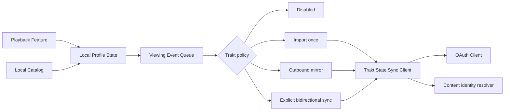

# Trakt Free/VIP Service Opportunities

| | |
| --- | --- |
| **Status** | Observed product research; not a CineLark pricing contract |
| **Captured** | 2026-08-27 |
| **Audience** | CineLark product and media-platform contributors |
| **Time horizon** | Current Trakt product/API behavior and 2026 announcements |
| **Scope** | Free/VIP capability split, API feasibility, trust risks, and CineLark service opportunities |

## Executive read

Trakt demonstrates a useful commercial pattern: the free tier completes the
basic viewing-memory loop, while VIP primarily serves heavier usage, higher
limits, deeper control, automation, and richer personal insight. CineLark can
adopt that value architecture without making Trakt or any cloud account the
owner of local playback state.

The best opportunities are not simple feature copies. CineLark can turn its
local Catalog, Profile, and playback event data into smart continuation,
release awareness, rewatch mode, transparent sync, portable history, and
privacy-preserving viewing insight. Trakt integration should remain an optional
Profile-level sync plugin. A user's Trakt entitlement controls Trakt-side
limits; a CineLark purchase must not pretend to unlock Trakt VIP capabilities.

Trakt's 2026 product direction is also instructive: free should feel complete
and fair, while VIP should target advanced use, heavier volume, deeper control,
and expensive customization. CineLark should follow that principle and avoid
paywalling playback correctness, Profile isolation, data ownership, or basic
source support.

## Observed free and VIP capability split

The dynamic Trakt VIP page was not reliably accessible during this research.
The table below therefore uses official Trakt API documentation, official
product announcements, and the official support forum. Exact pricing is not
asserted.

| Capability | Free / core behavior | VIP / advanced behavior | CineLark implication |
| --- | --- | --- | --- |
| Viewing history | Large watched-history allowance; manual history, check-ins, and scrobbling are core API workflows | Same announced 100K history ceiling; VIP value is not basic history ownership | Basic CineLark playback history must never require a subscription |
| Watchlist | Core watchlist with an announced 250-item free limit | Announced 5K limit and VIP-enhanced item notes | Local CineLark watchlist stays unlimited by Trakt; mirror adapts to remote limits |
| Personal lists | Five personal lists and 250 items per list in the announced 2026 structure | Up to 100 lists and 5K items per list in the announced structure | Sell better organization and automation, not the right to create one useful list |
| Dynamic lists | Five filter-backed lists in the announced free structure | Up to 100 dynamic lists plus deeper filter workflows | Saved Catalog queries are a strong CineLark service opportunity |
| Ratings and favorites | Core user-state capabilities exposed through the API | Higher announced ratings limit and VIP-enhanced notes on some list operations | Keep local rating/favorite data independent and mirror only supported fields |
| Continue / Start Watching | Core home workflows built from progress and newly available watchlist items | More control, sorting, filtering, and higher-volume use | CineLark can compute these locally across configured sources |
| Calendar and discovery | Core personalized/global calendars, recommendations, trends, and public lists | Advanced filters, saved filters, deeper discovery control | Separate release intelligence from media-source browsing |
| Rewatching | Basic history can record multiple plays | Explicit rewatch mode recalculates progress without deleting original plays | Model a rewatch session instead of resetting historical progress |
| Personal insight | Basic profile and aggregate stats are available | Month/Year in Review, all-time analysis, and deeper drilldowns | CineLark can create private on-device insight from Profile data |
| Streaming/Plex sync | Trakt is moving selected casual sync workflows toward free with sensible limits | Multiple servers, larger libraries, near-real-time sync, more services, and deeper controls | Heavy automation is monetizable, but reliability and undo are mandatory |
| Widgets and customization | Core application experience | Personalized widgets, preview/beta access, and more customization | Data-driven home presets are safer than runtime code modules |
| Data export | Manual export and Public API access remain available | Automatic backups were retired in March 2026 | Export without tested restore is not a backup; CineLark must support round-trip portability |

### Announced 2026 account limits

Trakt announced the following structure. The rollout notice stated that some
changes were immediate and others progressive. CineLark must read the live
`/users/settings` limits and permissions instead of hardcoding this table.

| Resource | Free | VIP |
| --- | ---: | ---: |
| Watched history | 100,000 | 100,000 |
| Ratings | 10,000 | 20,000 |
| Watchlist items | 250 | 5,000 |
| Items per personal list | 250 | 5,000 |
| Total personal-list items | 1,000 | 100,000 |
| Personal lists | 5 | 100 |
| Dynamic lists | 5 | 100 |
| Physical library | 100 | 10,000 |
| Digital library | 1,000 | 100,000 |
| Notes | 100 | 2,000 |

## CineLark service opportunities

### 1. Viewing Memory

Create a durable, local-first record of what each Profile watched, when, from
which locator, and whether playback completed naturally.

**Core value**

- Continue watching, history, watchlist, favorites, and per-Profile isolation.
- Source-independent progress that survives removing or replacing a server.
- Manual correction, play deletion, and explicit import review.

**Advanced value**

- Year/month/all-time summaries.
- Genre, country, creator, runtime, weekday, and completion-pattern breakdowns.
- Drilldown from every aggregate to the underlying playback events.
- Private export and optional share cards generated on device.

**Commercial lesson:** Insight is a better premium boundary than basic history.

### 2. Smart Continuation

Combine local playback state, episode hierarchy, release dates, and source
availability into user-intent lanes.

- `Continue Watching`: resumable movies and next available episodes.
- `Start Watching`: newly released watchlist items available on a configured
  source.
- `Up Next`: the next unwatched episode, with specials and dropped shows
  handled explicitly.
- `Recently Available`: content newly added to the active source or Catalog.

**Commercial lesson:** The free experience should complete the everyday loop.
Advanced sorting, multi-source rules, and automation can remain premium.

### 3. Rewatch Sessions

A rewatch should not erase the original watch history or falsely mark every
episode unwatched.

```text
Profile
  └─ Series viewing state
       ├─ lifetime progress
       └─ active rewatch session
            ├─ startedAt
            ├─ baseline history boundary
            └─ session progress
```

This is reusable beyond Trakt: family members often revisit a series before a
new season while wanting lifetime statistics to remain correct.

### 4. Release Intelligence

Use `ContentKey` and optional metadata providers to enrich the local Catalog
with release-aware behavior:

- upcoming episodes and season premieres;
- finales and completed-season signals for binge watchers;
- streaming/home-media release dates;
- reminders scoped to one CineLark Profile;
- watchlist items that become playable on a configured source.

This should be an independent metadata/release provider role. It must not turn
Trakt into a Media Source or assume Trakt has a playable locator.

### 5. Saved Discovery Rules

Trakt's dynamic lists and advanced filters show that users value reusable
queries more than one-off filter panels.

Potential CineLark examples:

- unwatched 4K movies under two hours;
- completed series available on the home NAS;
- unwatched episodes released this week;
- family-safe animation added in the last 30 days;
- items available from a preferred direct-play source;
- watchlist items missing from every configured source.

Store these as versioned `MediaQuery` definitions. They remain data, not runtime
modules, and can later sync through iCloud.

### 6. Transparent Sync

Trakt's public support history exposes the trust cost of delayed, incomplete,
or incorrectly matched automatic sync. CineLark should make synchronization an
observable product surface rather than a silent background side effect.

Required behavior:

- last successful import and mirror timestamps;
- pending, sent, rejected, and retrying event counts;
- per-item provenance and the matched identity used;
- preview before a large first import;
- duplicate detection before sending history;
- undo for the last import batch;
- pause and disconnect without deleting local data;
- explicit conflict records instead of last-writer mystery.

**Commercial lesson:** Higher-frequency automation can be premium; visibility,
safe cancellation, and recovery are correctness requirements for everyone.

### 7. Real Data Portability

Trakt retired automatic backups in March 2026 and directed users toward manual
export or the Public API. Earlier exports were criticized because self-service
restore was not available.

CineLark should define portability as a round trip:

1. Export a versioned, documented package.
2. Validate the package before destructive action.
3. Preview import counts and conflicts.
4. Restore into a new Profile without provider credentials.
5. Verify referential integrity and report skipped records.

An export that CineLark cannot import is an archive, not a backup.

### 8. Household-Safe Personalization

Trakt is primarily account-centric. CineLark can differentiate through a
Profile-centric household model:

- independent continuation, watchlist, ratings, and discovery rules;
- one optional Trakt account per CineLark Profile;
- local Profile switching without switching every media-server account;
- private statistics by default;
- optional aggregate household recommendations without exposing individual
  history.

This is a CineLark-owned service advantage rather than a Trakt feature copy.

## Recommended product packaging principle

This is a value-boundary recommendation, not a final pricing proposal.

### Always available

- Reliable playback and source setup.
- Local Catalog and cache management.
- Multiple Profiles with isolated favorites and progress.
- Basic continue watching, history, watchlist, and data export.
- Manual Trakt import/export where supported by the connected account.
- Sync status, error visibility, and safe disconnect.

### Suitable for a CineLark advanced tier

- Multi-source saved discovery rules and advanced filters.
- Rich private statistics, review cards, and drilldowns.
- Rewatch sessions and configurable release intelligence.
- High-frequency background mirroring and multiple external sync services.
- Automation rules, scheduled exports, and validated restore workflows.
- Cross-Apple-ID family sharing if CineLark later operates the required service.

### Must remain Trakt-entitlement dependent

- Trakt list, watchlist, note, rating, or library capacity.
- Trakt VIP-enhanced API fields and operations.
- Trakt streaming/Plex synchronization services.
- Trakt-specific advanced filters, stats, widgets, or preview access.

A CineLark subscription cannot and should not bypass these remote account
constraints.

## Integration boundary

Trakt should be implemented as a state-sync and discovery integration, not as a
Media Source.



### Role and ownership

- Add an independent `ViewingStateSyncPlugin` or equivalent integration role.
- Bind it to `CineLarkProfileID`, never directly to a Source.
- Permit at most one outbound owner for a Trakt account binding.
- Keep CineLark local state as the UI truth.
- Store Trakt tokens in Keychain and sync no credentials through CloudKit.

### Authentication

- Use OAuth Authorization Code flow on macOS.
- Reserve Device Code flow for tvOS, Remote, or limited-input surfaces.
- Access tokens currently expire after seven days.
- Refresh tokens are single-use; serialize refresh in an actor and atomically
  replace both tokens after success.
- Revoke the access token when the user disconnects the integration.

### Sync mechanics

- Use `/sync/last_activities` timestamps before fetching large state sets.
- Use local event IDs and an actor-backed queue for offline delivery.
- Deduplicate history by identity and `watchedAt`; Trakt explicitly does not
  guarantee duplicate protection for history additions.
- Normalize `420` limit errors into an entitlement/limit domain failure.
- Read `/users/settings` limits and permissions dynamically.
- Send scrobble events for start, pause, and stop only when mirroring is enabled.
- Mark completion locally first; remote acknowledgement does not gate playback.

### Identity

- Resolve using Trakt, TMDB, TVDB, or IMDb identifiers through `ContentKey`.
- Never use Trakt identity as a `MediaLocatorID`; Trakt does not identify a
  playable file or server path.
- Surface uncertain episode matches for review instead of mirroring the wrong
  play.

### Artwork

Trakt requires clients to cache returned images and forbids direct CDN
hotlinking. Artwork must use CineLark's cache service and normal purge/accounting
rules.

## Ranked product risks

| Rank | Risk | Evidence signal | CineLark response |
| ---: | --- | --- | --- |
| 1 | Silent or incorrect automatic sync damages trusted history | Repeated 2025–2026 reports of delayed, missing, duplicated, or mismatched streaming sync | Preview, provenance, dedupe, undo, and visible queue health |
| 2 | Paid value changes undermine subscription trust | Automatic backups were retired; Trakt is actively redefining VIP | Publish durable entitlement principles and avoid selling correctness |
| 3 | UI modernization can remove expert workflows | V3 transition reports cite missing filters, calendar detail, list actions, and information density | Preserve semantic capabilities and keyboard workflows across redesigns |
| 4 | Export without restore creates false confidence | Trakt acknowledged no self-service restore for earlier automatic exports | Test export/import round trips as one feature |
| 5 | Hardcoded remote limits age immediately | Trakt introduced a new 2026 limit structure and progressive rollout | Read live limits and permissions from the account API |

## Opportunity map

### Build in the current architecture

- Establish the Profile-level state-sync plugin role.
- Preserve the event queue, identity, entitlement, and error-normalization
  boundaries before implementing Trakt transport.
- Add sync status and provenance requirements to the Settings information
  architecture.

### Candidate next-quarter product slice

- OAuth connection and account status.
- One-time history/watchlist import with preview and undo.
- Optional outbound playback scrobbling.
- Last-activity delta checks, offline queueing, and duplicate protection.
- Local Continue Watching and Start Watching improvements using Catalog state.

### Needs deeper validation

- Which Trakt endpoints are currently marked VIP Enhanced for every target
  workflow.
- API v3 migration timing; the public API still uses v2 contracts as of July
  2026, with a future v3 announced.
- App review, attribution, branding, fair-use, and production rate-limit terms.
- User willingness to pay for statistics, automation, restore, or family
  sharing independently of a Trakt VIP subscription.

## Source map

### Official product and support sources

- [Trakt 2026 Free/VIP limits](https://forums.trakt.tv/t/updating-trakt-limits-for-2026/101592/5)
- [May 2026 product direction](https://forums.trakt.tv/t/trakt-product-update-may-2026/111812)
- [March 2026 product roundup](https://forums.trakt.tv/t/trakt-product-roundup-march-2026/105795)
- [Continue Watching and Start Watching](https://forums.trakt.tv/t/new-trakt-feature-spotlight-continue-watching-start-watching/89875)
- [Advanced filtering](https://forums.trakt.tv/t/advanced-filtering/19088)
- [All-time statistics](https://forums.trakt.tv/t/all-time-stats/19086)
- [Rewatching TV shows](https://forums.trakt.tv/t/rewatching-tv-shows/19094)
- [Personalized widgets](https://forums.trakt.tv/t/personalized-widgets/19095)
- [Retirement of automatic backups](https://forums.trakt.tv/t/retiring-automatic-backups/102430)
- [Apps and streaming/Plex sync](https://media-og.trakt.tv/apps)

### Official API sources

- [API introduction](https://docs.trakt.tv/docs/getting-started)
- [OAuth authentication](https://docs.trakt.tv/docs/authentication-oauth)
- [Scrobbling](https://docs.trakt.tv/reference/about-scrobble)
- [User settings, limits, and permissions](https://docs.trakt.tv/reference/getuserssettings)
- [Last activity timestamps](https://docs.trakt.tv/reference/getsynclastactivities)
- [Add watched history](https://docs.trakt.tv/reference/postsynchistoryadd)
- [Playback progress](https://docs.trakt.tv/reference/getsyncprogressplayback)
- [Up Next](https://docs.trakt.tv/reference/getsyncprogressupnextstandard)
- [Watchlist](https://docs.trakt.tv/reference/getsyncwatchlistget)
- [Movie recommendations](https://docs.trakt.tv/reference/getrecommendationsmoviesrecommend)
- [Show recommendations](https://docs.trakt.tv/reference/getrecommendationsshowsrecommend)
- [Artwork caching requirement](https://docs.trakt.tv/docs/images)

### Public reliability signal

- [Streaming-sync reliability discussion](https://forums.trakt.tv/t/automatically-sync-your-streaming-services/34947?page=22)
- [Automatic tracking limitations](https://forums.trakt.tv/t/automatic-tracking/78740)
- [V3 transition feedback](https://forums.trakt.tv/t/trakt-product-update-may-2026/111812)

## Evidence limits

- The Trakt web VIP page is dynamic and was not reliably retrievable, so this
  document avoids asserting exact pricing or an exhaustive current benefit list.
- Official forum announcements combine shipped behavior, progressive rollout,
  and future direction. Each integration must consult live API behavior and
  `/users/settings` entitlements.
- Forum complaints provide reliability and trust signals, not measured incident
  frequency across the full Trakt population.
- This research does not constitute legal approval for commercial API usage or
  Trakt branding. Re-check current developer terms before release.
